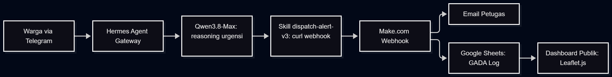
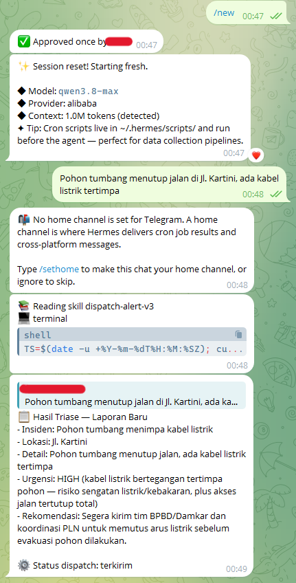
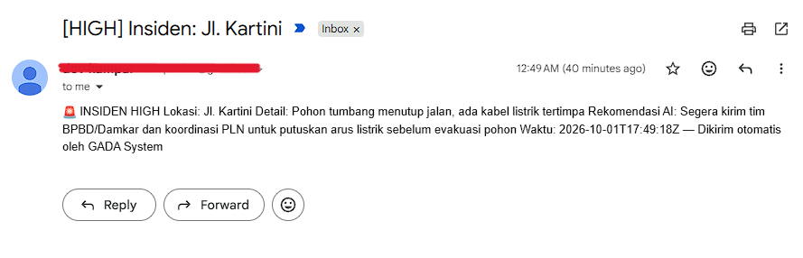
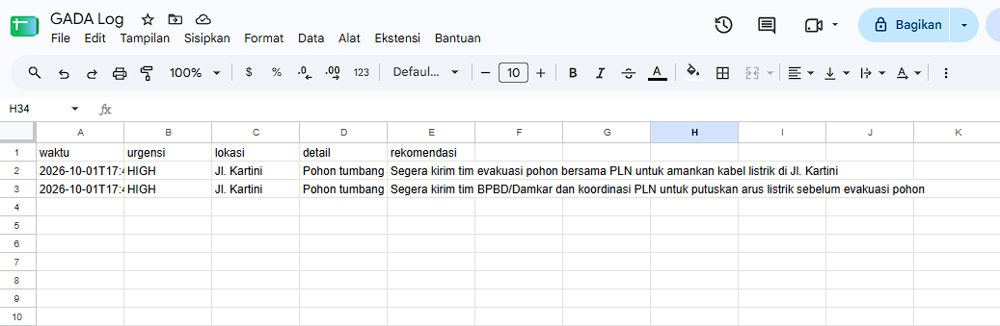
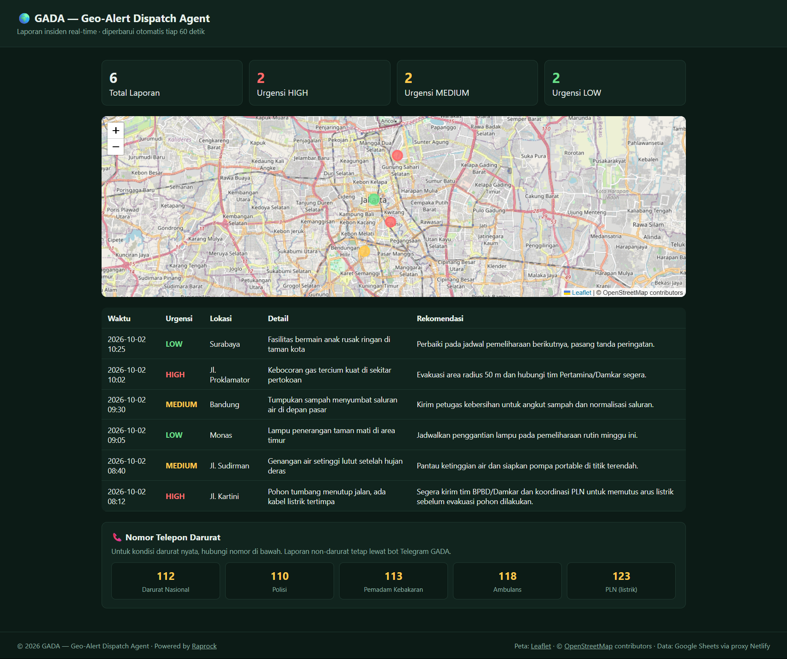

# 🌍 GADA — Geo-Alert Dispatch Agent
Triase & distribusi laporan insiden publik berbasis AI Agent.
Hermes Agent on Alibaba Cloud SAS (course bisa.ai) · Model Qwen3.8-Max.

## Nilai Bisnis
Triase laporan warga dari ±30 menit menjadi <15 detik: analisis urgensi otomatis
oleh LLM, dispatch email petugas via Make.com, log terstruktur di Google Sheets,
dan dashboard publik transparan berbasis peta.

## Arsitektur
Warga (Telegram) → Hermes Agent Gateway (profile gada_agent) → Qwen3.8-Max
(reasoning urgensi) → Skill dispatch-alert-v3 (tool terminal: curl webhook)
→ Make.com → [Email petugas + Google Sheets] → Dashboard publik (Leaflet.js).

## Diagram Arsitektur


## Fitur
- Klasifikasi urgensi HIGH/MEDIUM/LOW + rekomendasi tindakan oleh Qwen3.8-Max
- Dispatch email otomatis berformat sesuai urgensi (Make.com, tanpa SMTP sendiri)
- Log insiden terstruktur & dashboard pelayanan publik: peta Leaflet + statistik + tabel
- Observabilitas penuh: sesi, skill-loading, dan tool-call tercatat di dashboard Hermes

## Skema Data (CSV)
Dashboard membaca CSV dengan kolom berikut (urutan kolom bebas, header wajib ada):

| Kolom | Tipe | Keterangan |
|---|---|---|
| `waktu` | teks | Timestamp laporan, mis. `2026-10-02 08:12` |
| `urgensi` | enum | `HIGH` / `MEDIUM` / `LOW` — menentukan warna marker & badge tabel |
| `lokasi` | teks | Dicocokkan ke `LOCATION_DB` di `index.html` (substring, case-insensitive) |
| `detail` | teks | Deskripsi insiden; bungkus dengan quote bila mengandung koma |
| `rekomendasi` | teks | Tindakan konkret hasil triase LLM |

Contoh baris:

```csv
waktu,urgensi,lokasi,detail,rekomendasi
2026-10-02 08:12,HIGH,Jl. Kartini,"Pohon tumbang menutup jalan, ada kabel listrik tertimpa","Segera kirim tim BPBD/Damkar dan koordinasi PLN."
```

> Catatan geocoding: MVP memakai dictionary `LOCATION_DB` (substring match).
> Lokasi yang tidak cocok tetap masuk tabel & statistik, tetapi tidak ditampilkan sebagai marker peta.

## Setup Pipeline (Agent → Make.com → Sheets)
1. Install Hermes Agent on Alibaba Cloud SAS; buat profile `gada_agent` (model qwen3.8-max).
2. Import skill `dispatch-alert-v3` (file terlampir); attach ke profile.
3. Channel Telegram: isi bot token; Restart Gateway.
4. Make.com: scenario Webhook → Gmail → Google Sheets; lakukan "Detect new values"; toggle ON.
5. Publish sheet sebagai CSV; URL-nya dipakai di `_redirects` (deploy) dan `GOOGLE_CSV_URL` (fallback local).

## Cara Menjalankan (Local Preview)
1. Clone repo ini; file dummy `data.csv` sudah disertakan di root sebagai sumber data local.
2. Jalankan static server dari root repo — **jangan buka via `file://`** karena `fetch()` tidak akan jalan:

   ```bash
   npx serve .
   # alternatif: python -m http.server 8000
   # alternatif: extension VS Code "Live Server"
   ```

3. Buka `http://localhost:3000` (port menyesuaikan server). Kartu statistik, tabel, dan
   marker peta terisi dari `data.csv` dummy; basemap memakai tile OpenStreetMap (tanpa API key).
4. Dashboard auto-refresh tiap 60 detik. Bila semua sumber CSV gagal, muncul mode manual
   (tempel isi CSV lalu klik Render).

## Deploy (Netlify) & Strategi File-Proxy
1. Deploy repo ini ke Netlify sebagai static site (publish directory: root repo).
2. File `_redirects` mem-proxy path same-origin `/data.csv` ke Google Sheet yang di-publish sebagai CSV:

   ```
   /data.csv  https://docs.google.com/spreadsheets/d/e/.../pub?gid=0&single=true&output=csv  200!
   ```

   - Status `200` = proxy/rewrite server-side → browser tetap meminta `/data.csv`
     (same-origin, sehingga bebas masalah CORS).
   - Tanda `!` (force) membuat proxy **meng-override** file dummy `data.csv` di repo saat deploy,
     sehingga dashboard menampilkan data live dari Google Sheet.
3. Publish sheet: File → Share → Publish to web → pilih CSV; ganti URL di `_redirects`
   (dan konstanta `GOOGLE_CSV_URL` di `index.html` bila perlu).
4. Fallback chain di fungsi `load()`: `/data.csv` (proxy Netlify) → URL Google Sheet langsung → mode manual.

## Struktur Repository

```
gada-dashboard/
├── index.html                  # Dashboard single-file: Leaflet + parser CSV + render
├── data.csv                    # Data dummy untuk local preview (di-override proxy saat deploy)
├── _redirects                  # Netlify force-proxy: /data.csv → Google Sheet CSV (200!)
├── skill-dispatch-alert-v3.md  # Prompt skill Hermes Agent (triase + dispatch webhook)
├── README.md
└── img/
    ├── telegram_screenshot.png    # Screenshot asli: laporan Telegram → triase → dispatch
    ├── email_screenshot.png       # Screenshot asli: email dispatch Make.com (Gmail)
    ├── sheets_screenshot.png      # Screenshot asli: Google Sheets "GADA Log"
    ├── dashboard_screenshot.jpg   # Screenshot asli: dashboard (statistik, peta, tabel, nomor darurat)
    ├── system_architechture.png   # Diagram arsitektur pipeline
    ├── placeholder_email.svg      # Placeholder lama — tidak dipakai lagi, boleh dihapus
    ├── placeholder_sheets.svg     # Placeholder lama — tidak dipakai lagi, boleh dihapus
    └── placeholder_dashboard.svg  # Placeholder lama — tidak dipakai lagi, boleh dihapus
```

## Basemap Peta
- Default: **OpenStreetMap standard** (`https://tile.openstreetmap.org/{z}/{x}/{y}.png`) —
  tanpa API key, reliabel untuk local preview maupun deploy.
- Alternatif gelap sesuai tema dashboard: ganti URL `L.tileLayer(...)` di `index.html` ke
  `https://{s}.basemaps.cartocdn.com/dark_all/{z}/{x}/{y}{r}.png` (juga keyless,
  namun host CARTO sesekali rate-limited).
- Attribution `© OpenStreetMap contributors` wajib disertakan sesuai OSM tile usage policy.

## Trade-offs & Rencana Pengembangan
- Geocoding peta memakai dictionary lokasi (MVP 48 jam); produksi: PostGIS + geocoder API.
- Publish CSV Google Sheet memiliki cache ±5 menit; produksi: API langsung ke database.
- Webhook Make.com belum ber-autentikasi (write-only endpoint); produksi: tambah secret header.
- Berikutnya: multi-channel (WhatsApp), SLA tracking, eskalasi berjenjang, memori lintas-session.

## Demo

### 1. Telegram → Triase Agent (screenshot asli)
Laporan warga masuk via Telegram, skill `dispatch-alert-v3` dibaca agent, hasil triase
urgensi HIGH + rekomendasi, lalu status dispatch terkirim.



### 2. Email dispatch (screenshot asli)
Email otomatis via scenario Make.com (Gmail): subjek `[HIGH] Insiden: Jl. Kartini` berisi
lokasi, detail, rekomendasi AI, dan timestamp — dikirim tanpa SMTP sendiri.



### 3. Google Sheets log insiden (screenshot asli)
Sheet "GADA Log" menampung setiap dispatch dengan kolom sesuai skema CSV
(`waktu, urgensi, lokasi, detail, rekomendasi`) — sekaligus sumber data dashboard.



### 4. Dashboard publik (screenshot asli)
Tampilan dashboard utuh: kartu statistik urgensi, peta Leaflet (basemap OSM) dengan
marker berwarna sesuai urgensi, tabel laporan, blok Nomor Telepon Darurat, dan footer.



> Semua screenshot demo di atas sudah asli; hanya URL video demo yang masih menyusul.

- [ ] URL Video demo 60 detik: _isi setelah upload_
